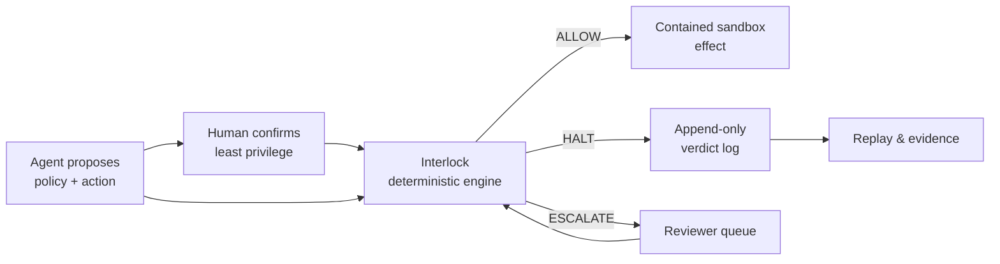

# Interlock

### Control every agent action.

**A deterministic safety layer between autonomous agents and the tools they can affect.**

[Live demo](https://interlock-demo.agreeablestone-318f5583.eastus.azurecontainerapps.io) · [Architecture](#architecture) · [Technology](#technology) · [Demo guide](docs/DEMO.md) · [License](#license)

---

## Why Interlock

Agent prompts are not authorization. An agent can misunderstand instructions, encounter adversarial text, or propose a tool call that exceeds the task's intended scope. Interlock evaluates the **concrete action** against a typed, human-confirmed policy before that action can reach an effect adapter.

The model may propose. The human owns authority. The deterministic engine decides.

| Without a control boundary | With Interlock |
| --- | --- |
| A model's interpretation becomes operational authority | A typed policy is reviewed before it becomes authority |
| Tool calls are trusted because they look plausible | Every tool call is checked against declared scope |
| Failures are difficult to replay or explain | Verdicts, reasons, traces, and evidence are preserved |
| A broad policy can silently expand impact | Irreversible or out-of-scope actions halt or escalate |

## What it does

1. **Draft** — an agent or model proposes a least-privilege policy and a concrete tool action.
2. **Confirm** — a human inspects and confirms the authority that policy grants.
3. **Interlock** — a pure deterministic engine returns `ALLOW`, `HALT`, or `ESCALATE` before a contained local effect can run.
4. **Prove** — the dashboard exposes the decision trail, replay results, review queue, and tamper-evident evidence bundle.

## Safety Operations Center

The dashboard makes the enforcement boundary inspectable instead of hiding it behind a chat interface.

| Workspace | Operator question it answers |
| --- | --- |
| **Safety overview** | What is Interlock enforcing, and what is the current decision posture? |
| **Policy studio** | What exact database, tool, and pattern authority will this policy grant? |
| **Live activity** | Why was an action allowed, halted, or escalated? |
| **Review queue** | Which actions and learning candidates require a human decision? |
| **Assurance** | Does a candidate preserve known-safe behavior and halt known-bad cases? |
| **Evidence** | Can the decision and replay evidence be independently verified? |

## Built to demonstrate—not merely describe

| Capability | Demonstration | Safety boundary |
| --- | --- | --- |
| Least-privilege policy | Draft, inspect, and explicitly confirm typed authority | Drafts never grant authority by themselves |
| Deterministic enforcement | Evaluate each tool call as `ALLOW`, `HALT`, or `ESCALATE` | The engine never asks an LLM for a verdict |
| Attack containment | Exercise a destructive prompt path and halt it | No destructive operation is dispatched |
| Developer-agent trace simulation | Measure allowed actions, halts, misses, and friction | Trace simulation cannot dispatch effects |
| Guardrail memory | Admit verified failure patterns through reviewer governance | Agents cannot activate their own guardrails |
| Assurance evidence | Replay cases and verify fixture-only evidence bundles | Advisory and report-only; no runtime mutation |
| Multica compatibility | Preview strict local callback and quarantine contracts | No live Multica daemon, API, or network call |

## Technology

| Layer | Technology | Role in Interlock |
| --- | --- | --- |
| **Deterministic core** | Python 3.13, Pydantic, PyYAML | Typed policy contracts and pure policy-as-code enforcement |
| **API & realtime surface** | FastAPI, Uvicorn, Server-Sent Events | Dashboard contracts, simulator, evidence verification, and activity stream |
| **Operator experience** | Next.js 15, React 19, TypeScript 5.8 | Safety Operations Center and policy/review/evidence workspaces |
| **Agent-facing integration** | OpenAI Agents SDK | Optional policy-draft and agent path; never part of the enforcement decision |
| **Observability & local state** | Langfuse-compatible instrumentation, SQLite fixtures | Inspectable local traces and deterministic demo state |
| **Verification** | Pytest, golden-scenario evaluation, Next.js build | Regression, purity, authorization, tenancy, and UI contracts |
| **Public staging delivery** | GitHub Actions, GitHub OIDC, GHCR, Azure Container Apps | Secretless build and deployment to an Azure-managed hostname |

## Try the live demo

Open the [public Interlock demo](https://interlock-demo.agreeablestone-318f5583.eastus.azurecontainerapps.io), then follow the visible operator path:

**Policy studio → review authority → confirm policy → run safety demo → inspect the decision stream.**

The hosted instance intentionally begins with an empty fixture dataset. Zero counters are expected until the safety demo generates contained `ALLOW` and `HALT` decisions. It is a public staging demonstration—not a customer-data, production, or live-Multica environment.

## Architecture

Interlock keeps generative and enforcement concerns intentionally separate:

- **Drafting plane** — an agent can turn a task into an inspectable policy draft.
- **Authorization plane** — a human explicitly confirms the scope.
- **Enforcement plane** — pure policy-as-code evaluates the concrete action.
- **Effect plane** — only allowed verdicts may reach contained adapters.
- **Evidence plane** — verdicts, replay results, lifecycle state, and verifiable bundles support review and regression control.

The enforcement engine imports no model, network client, database, or effect adapter. A dedicated purity test protects that invariant.

## Built with Codex and GPT-5.6

Codex accelerated implementation under the project rules in `AGENTS.md` and `rules.md`.
GPT-5.6 drafts typed policies and powers the contained demo agent through the OpenAI Agents SDK.
Neither Codex nor GPT-5.6 participates in the deterministic enforcement decision path.
Human confirmation and policy-as-code remain the final authority for every governed tool action.

## Repository map

| Path | Purpose |
| --- | --- |
| [`interlock/engine/`](interlock/engine/) | Pure deterministic policy and enforcement logic |
| [`interlock/api/`](interlock/api/) | FastAPI contracts, activity stream, and local orchestration |
| [`interlock/assurance/`](interlock/assurance/) | Replay, evidence, lifecycle, tenancy, and fixture-adapter controls |
| [`interlock/tools/`](interlock/tools/) | Contained local sandbox effect adapters |
| [`web/`](web/) | Next.js Safety Operations Center |
| [`tests/`](tests/) | Unit, contract, integration, purity, tenancy, and dashboard coverage |
| [`eval/`](eval/) | Golden-scenario safety evaluation |
| [`docs/`](docs/) | Demo script, runbooks, architecture, and Waterfall delivery record |

## Verification

Interlock is verified as a control system, not just a visual demo:

- Unit, contract, integration, purity, tenancy, API, and dashboard tests.
- Golden scenarios covering authorized benign actions and adversarial, malformed, forbidden, or out-of-scope actions.
- A fail-closed evaluator: a known-bad action must never be allowed and a known-good action must not be blocked.
- Frontend production build validation.

For local setup, the full demo script, and contributor commands, see the [demo guide](docs/DEMO.md) and [Waterfall delivery record](docs/WATERFALL_MASTER_PLAN.md).

## Deployment & boundaries

The public demo uses GitHub Actions OIDC, a GitHub Container Registry image, and Azure Container Apps. It contains no OpenAI key, client secret, customer data, production database, or live Multica connection.

Interlock is a hackathon project with deliberate production-oriented constraints—not a claim of production certification. Real deployment still requires tenant onboarding, verified identity, private networking, managed keys, external asset inventory, signed approvals, retention policy, and operational ownership. See the [public-demo deployment guide](docs/PUBLIC_DEMO_DEPLOYMENT.md) and [Azure OIDC runbook](docs/AZURE_OIDC_DEPLOYMENT_RUNBOOK.md).

## License

Released under the [MIT License](LICENSE).
