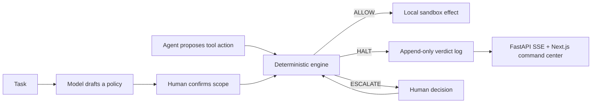

# Interlock

> Deterministic authorization for autonomous-agent tool calls.


Interlock is a local-first control plane that sits between an AI agent and the tools it can affect. A model may propose a least-privilege policy, but a human must confirm it and a deterministic engine decides every subsequent action. Interlock is designed to make agent behavior inspectable, replayable, and safe to demo without granting a model authority over the enforcement boundary.

**The core promise:** authorized reads stay fast; malformed, forbidden, out-of-scope, or irreversible actions are stopped or escalated before an effect is dispatched.

## Why Interlock

Agent prompts are not an authorization system. They can be misunderstood, overridden by adversarial text, or silently broadened by a tool call. Interlock reconciles the _actual proposed action_ with a typed, human-confirmed policy instead of asking another model whether the prompt appears safe.

## Where Interlock fits

Interlock is deliberately narrower than an agent platform and different from an investigation system:

| System concern | Interlock's role | Explicit non-goal |
| --- | --- | --- |
| Agent work coordination | Govern each proposed tool action, preserve the decision trail, and route irreversible actions to a human | Issue routing, agent staffing, or task-board replacement |
| Agent reasoning | Allow a model to propose a policy or task action | Let a model validate, approve, or override its own authority |
| Evidence and assurance | Replay safety cases and compare typed authority in report-only mode | Claim a release is safe without replay/evidence results |
| External orchestration | Produce a strict fixture-only advisory callback contract | Connect to a live Multica daemon, task board, or webhook |

This makes Interlock complementary to [Multica](https://github.com/multica-ai/multica), which focuses on managing coding-agent work, and conceptually aligned with [CausalOps](https://github.com/darshgarg7/CausalOps), whose design separates model proposals from evidence-backed validation. Interlock applies that separation to **runtime authorization**: a model can propose; deterministic policy and human approval decide what can happen.

## In 60 seconds

1. Open the **Safety overview** and verify that local runtime and report-only assurance are available.
2. Use **Policy studio** to draft a task policy. The **Policy authority** surface shows the exact tool, database, and pattern scope before it has authority.
3. Confirm the policy, then run the local safety demo. The **Live decision stream** exposes `ALLOW`, `HALT`, and `ESCALATE` outcomes with the matched policy reason.
4. Open **Review queue** to resolve any human-owned escalation or candidate review.
5. Generate an **Evidence workspace** bundle to verify a local replay result and authority delta without dispatching an external effect.



## What the demo proves

| Capability | What Interlock does | Boundary |
| --- | --- | --- |
| Least-privilege policy | Builds and displays a typed policy, then requires explicit confirmation | A policy draft is not authority |
| Deterministic enforcement | Decides each tool call with policy-as-code | The enforcement engine never consults an LLM |
| Attack containment | Injects a destructive prompt to demonstrate an explicit halt | No real destructive operation is performed |
| Trace simulation | Replays labeled developer-agent steps and reports coverage and friction | Simulation never dispatches effects |
| Learning guardrails | Captures verified patterns as human-reviewable candidates | Agents cannot activate their own guardrails |
| Assurance memory | Replays approved failure cases and generates verifiable local evidence | Advisory only; no runtime mutation |
| Multica fixture adapter | Previews a typed local callback and quarantine decision | No Multica daemon, API, or network call |

Every visible effect is deliberately contained: local SQLite fixtures, a contained local directory, and an in-memory mock ledger. The demo has no shell execution, network effect, real transfer, real database, external task callback, or deployed Azure workload.

## Experience the demo

Start the backend and dashboard, then follow the numbered workflow in the command center:

1. **Draft a policy** for the default developer task.
2. **Review and confirm** the editable least-privilege JSON policy.
3. **Simulate the developer trace** to inspect safe actions allowed, unsafe actions stopped, false blocks, unsafe misses, and impacted sessions.
4. **Run the safety demo** or turn on **Add an unsafe instruction** and run the guarded agent. The live stream shows the allowed read and deterministic halt.
5. Use the **Assurance workspace** to review a candidate guardrail, replay an approved regression fixture, and verify a fixture-only evidence bundle.

The dashboard is intentionally an operator-facing command center: the primary path appears first, and release assurance, local evidence, and adapter previews remain visible as advanced capabilities—not hidden model behavior.

## Quick start

### Prerequisites

- Python 3.13+
- Node.js 20+
- An OpenAI API key **only** if you want live policy-draft and agent calls

```bash
git clone git@github.com:Myan17/OpenAI-Hack.git
cd OpenAI-Hack

python3.13 -m venv .venv
.venv/bin/python -m pip install -e '.[dev]'

# Optional for live model-backed policy draft / agent demo.
cp .env.example .env
# Add OPENAI_API_KEY to .env locally. Never commit it.

.venv/bin/python -m uvicorn interlock.api.main:app --reload
```

In a second terminal:

```bash
cd web
npm install
npm run dev
```

Open [http://127.0.0.1:3000](http://127.0.0.1:3000).

## Architecture

Interlock keeps generative and enforcement concerns separate:

- **Drafting plane:** a model can translate a task into an inspectable policy draft.
- **Authorization plane:** a human explicitly confirms the scope.
- **Enforcement plane:** pure, deterministic policy-as-code returns `ALLOW`, `HALT`, or `ESCALATE` for the concrete tool call.
- **Effect plane:** only a verdict that passes the boundary may reach the local sandbox implementation.
- **Evidence plane:** verdicts, replay results, lifecycle state, and tamper-evident evidence bundles support audit and regression control.

The enforcement engine is intentionally pure: it imports no model or network client. A dedicated purity test executes engine imports in a fresh process to preserve that invariant.

## Verification

Run the local quality gate before changing policy, workflow, or UI behavior:

```bash
.venv/bin/python -m pytest -p no:cacheprovider -q
.venv/bin/python -m eval.run
cd web && npm run build
```

`eval.run` executes 25 golden scenarios: 10 authorized benign reads and 15 adversarial, malformed, forbidden, or out-of-scope actions. The gate fails if any known-bad action is not halted or any known-good action is blocked.

To validate a saved local evidence bundle without calling the API server:

```bash
.venv/bin/python -m interlock.assurance.cli verify evidence-bundle.json
```

It returns `0` for a valid bundle, `1` for tampered or invalid evidence, and `2` for unreadable or malformed input.

## Deployment posture

The repository contains an Azure-oriented, multi-tenant deployment foundation and an OIDC workflow contract. It is intentionally **not a live production deployment**.

- The Bicep template is a parameterized, non-deployed foundation.
- GitHub Actions uses OIDC and avoids client secrets.
- Staging and production require separate GitHub Environments and resource groups.
- A `what-if` runs before an explicit infrastructure apply.
- Multica integration is fixture-only and advisory; it does not contact a real endpoint.

Read [the Azure OIDC deployment runbook](docs/AZURE_OIDC_DEPLOYMENT_RUNBOOK.md), [the multi-tenant execution plan](docs/AZURE_MULTITENANT_WATERFALL_EXECUTION_PLAN.md), and [the infrastructure README](infra/README.md) before enabling any apply step.

## Repository guide

| Path | Purpose |
| --- | --- |
| `interlock/engine/` | Pure deterministic policy and enforcement logic |
| `interlock/api/` | FastAPI contracts, SSE feed, local orchestration |
| `interlock/assurance/` | Replay, evidence, lifecycle, tenancy, and fixture adapter controls |
| `interlock/tools/` | Local sandboxed effect adapters |
| `web/` | Next.js operator command center |
| `tests/` | Unit, contract, integration, purity, tenancy, and dashboard tests |
| `eval/` | Golden-scenario safety evaluation |
| `infra/` | Parameterized Azure foundation and guarded workflow |
| `docs/` | Research, system design, runbooks, and Waterfall plans |

## Security model and current limits

Interlock is a hackathon prototype with real safety design constraints, not a claim of production certification. The dashboard and local adapters are safe by construction for the demo, but production use still needs reviewed infrastructure, real identity proofing, tenant onboarding, private networking, key management, external asset inventory, signed approvals, retention policy, and operational ownership.

In-policy irreversible actions currently return `ESCALATE` rather than running automatically. The policy compiler is conservative and falls back to deny-all on failure. The current Multica adapter is intentionally local and fixture-only.

## Contributing

Keep changes deterministic, scoped, and verifiable:

1. Preserve `interlock.engine` purity—no model, network, database, or effect adapter in the enforcement path.
2. Add a focused test before or alongside any behavior change.
3. Run the full Python suite, golden evaluation, and frontend build before committing.
4. Do not add credentials, generated local data, or cloud identifiers to the repository.
5. Treat Azure, Entra, GitHub OIDC, Multica endpoints, and any external effect as separately authorized operations.

For the complete design and delivery record, start with [the master Waterfall plan](docs/WATERFALL_MASTER_PLAN.md) and [the demo guide](docs/DEMO.md).
